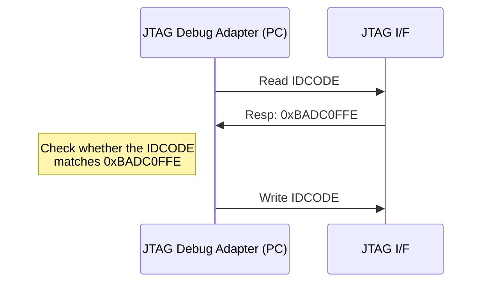
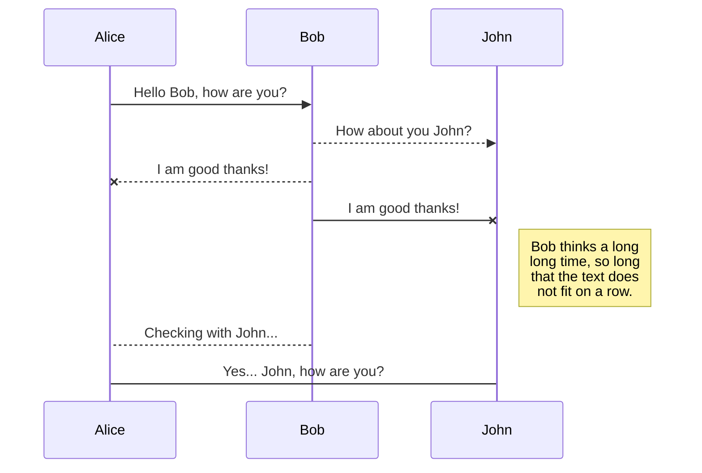
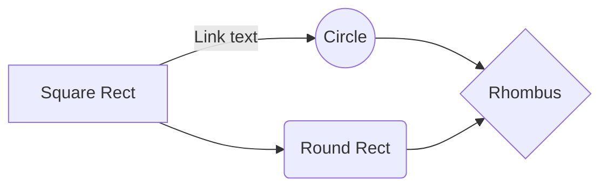

# JTAG to AXI master

## Table of Contents
* [Description](#intro)
* [License](#lic)

## <a name="intro"></a> Description


This design implements a JTAG interface that is capable of dispatching AXI Lite transactions into an AXI bus. Its main ob
jectives are:

1. To debug SoC peripherals connected to an AXI bus - dispatch read / write single beat burst AXI transactions.
2. Program memories in SoCs to act as a bootloader interface.

The **instruction register** length is 4-bits long and the data registers available are defined in the table below:

|    **Name**    | **Encoding (4 bits)** | **Access (RW/RO)** |      **Bit length**      |                       **Description**                       |
|:--------------:|:---------------------:|:------------------:|:------------------------:|:-----------------------------------------------------------:|
|     EXTEST     |          0000         |         TBD        |            TBD           |                             TBD                             |
| SAMPLE_PRELOAD |          1010         |         TBD        |            TBD           |                             TBD                             |
|    IC_RESET    |          1100         |         RW         |   IC_RST_WIDTH - Def. 4  | Programmable register to be used to control external resets |
|     IDCODE     |          1110         |         RO         |            32            |        Returns the IDCODE of the device - 0xBADC0FFE        |
|     BYPASS     |          1111         |         RW         |             1            |                Standard bypass jtag register                |
|  ADDR_AXI_REG  |          0001         |         RW         | ADDR_AXI_WIDTH - Def. 32 |         Indicates the AXI address of the transaction        |
|   DATA_W_REG   |          0010         |         RW         | DATA_AXI_WIDTH - Def. 64 |             Indicates the AXI data to be written            |
|   DATA_R_REG   |          0011         |         RO         | DATA_AXI_WIDTH - Def. 64 |                 Indicates the AXI read data                 |
|  CTRL_AXI_REG  |          0100         |         RW         |             2            |               Controls AXI master I/F dispatch              |
| STATUS_AXI_REG |          0101         |         RO         |             3            |           Return the status of the AXI transaction          |

## Flow sequence

For a write sequence:


## 
```bash
jtag
> cable jlink
> frequency 10000000
> detect
```


## <a name="lic"></a> License
`jtag_axi` is licensed under the permissive MIT license.Please refer to the [LICENSE](LICENSE) file for details.



And this will produce a flow chart:


