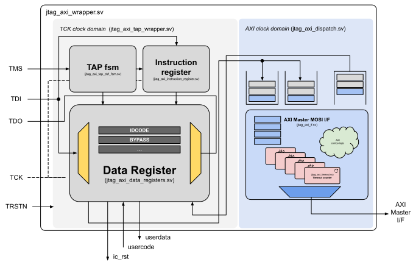

# JTAG to AXI master

## Table of Contents
* [Description](#intro)
* [Encoding of AXI registers](#axi_drs)
* [License](#lic)



## <a name="intro"></a> Description

This design implements a JTAG interface that is capable of dispatching AXI Lite transactions into an AXI bus. Its main ob
jectives are:

1. To debug SoC peripherals connected to an AXI bus - dispatch read / write single beat burst AXI transactions.
2. Program memories in SoCs to act as a bootloader interface.

|    **Name**    | **Encoding (4 bits)** | **Access (RW/RO)** |      **Bit length**      |                       **Description**                       |
|:--------------:|:---------------------:|:------------------:|:------------------------:|:-----------------------------------------------------------:|
|     EXTEST     |          0000         |         TBD        |            TBD           |                             TBD                             |
| SAMPLE_PRELOAD |          1010         |         TBD        |            TBD           |                             TBD                             |
|    IC_RESET    |          1100         |         RW         |   IC_RST_WIDTH - Def. 4  | Programmable register to be used to control external resets |
|     IDCODE     |          1110         |         RO         |            32            |        Returns the IDCODE of the device - 0xBADC0FFE        |
|     BYPASS     |          1111         |         RW         |             1            |                Standard bypass jtag register                |
|  ADDR_AXI_REG  |          0001         |         RW         | ADDR_AXI_WIDTH - Def. 32 |         Indicates the AXI address of the transaction        |
| DATA_W_AXI_REG |          0010         |         RW         | DATA_AXI_WIDTH - Def. 64 |             Indicates the AXI data to be written            |
| DATA_R_AXI_REG |          0011         |         RO         | DATA_AXI_WIDTH - Def. 64 |                 Indicates the AXI read data                 |
|  CTRL_AXI_REG  |          0100         |         RW         |             2            |               Controls AXI master I/F dispatch              |
| STATUS_AXI_REG |          0101         |         RO         |             3            |           Return the status of the AXI transaction          |

## <a name="axi_drs"></a> Encoding of AXI registers

The registers `CTRL_AXI_REG` and `STATUS_AXI_REG` follow a specific format and the its encoding is detailed down below.

### STATUS_AXI_REG

| **Value** | **Status meaning** |                                                                  **Description**                                                                  |
|:------------------:|:------------------:|:-------------------------------------------------------------------------------------------------------------------------------------------------:|
|          0         |      JTAG_IDLE     |                            That is the default state of the design when no <br>transactions (txn) have been dispatched                            |
|          1         |    JTAG_RUNNING    | When a transaction (txn) is started, the design will change to this state. <br>It should stay there until a response is received or it times out. |
|          2         |    JTAG_TIMEOUT    |                                                          Indicates a transaction timeout                                                          |
|          3         |    JTAG_AXI_OKAY   |                                                     Indicates a transaction response: AXI OKAY                                                    |
|          4         |   JTAG_AXI_EXOKAY  |                                                    Indicates a transaction response: AXI EXOKAY                                                   |
|          5         |   JTAG_AXI_SLVERR  |                                                    Indicates a transaction response: AXI SLVERR                                                   |
|          6         |   JTAG_AXI_DECER   |                                                    Indicates a transaction response: AXI DECER                                                    |

### CTRL_AXI_REG

|    CTRL_AXI_REG    |                    **AXI Data Read <br>(32 bits)**                   |               **Start<br>(1 bit)**               | **Txn type<br>(1 bit)** |               **Free Slots<br>(2 bits)**              |               **Size AXI txn<br>(3 bits)**              |
|:------------------:|:--------------------------------------------------------------------:|:------------------------------------------------:|:-----------------------:|:-----------------------------------------------------:|:-------------------------------------------------------:|
|      Bit order     |                                  MSB                                 |                        ...                       |           ...           |                          ...                          |                           LSB                           |
| **Access (RW/RO)** |                                  RO                                  |           RW<br>(writes not preserved)           |            RW           |                           RO                          |                            RW                           |
|   **Description**  | When read transaction is performed,<br>its data will be written here | Once written 1, dispatches<br>an AXI transaction |   1 - Write, 0 - Read   | Number of slots available<br>in the Asynchronous FIFO | Size of the AXI transaction<br>following AXIv4 encoding |

## AXI Write - Flow sequence

For a write sequence:


## AXI Read - Flow sequence

For a read sequence:


## 
```bash
jtag
> cable jlink
> frequency 10000000
> detect
```

---------------------------------------------


## <a name="lic"></a> License
`jtag_axi` is licensed under the permissive MIT license.Please refer to the [LICENSE](LICENSE) file for details.


And this will produce a flow chart:


